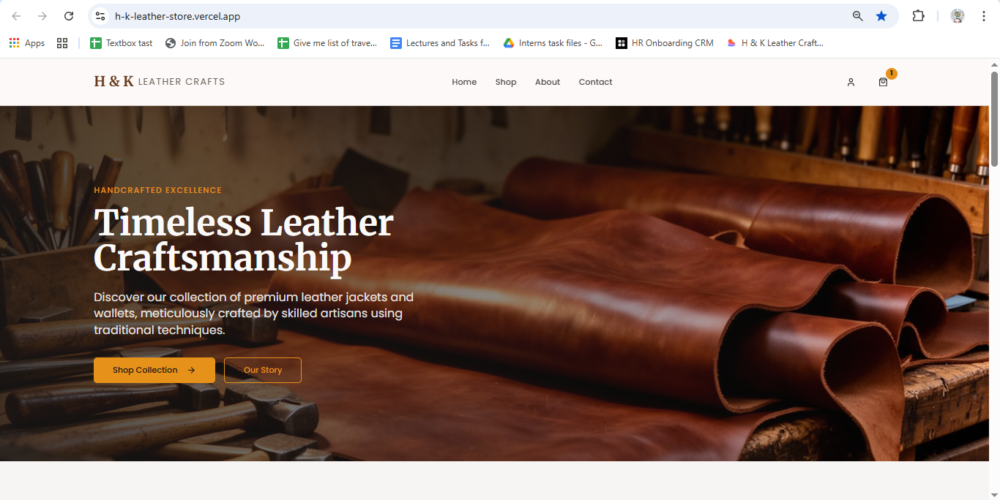
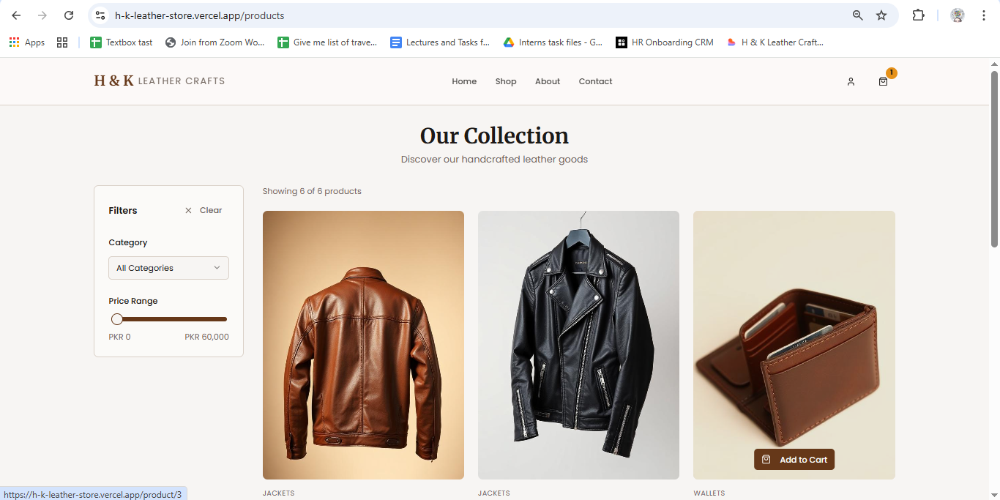
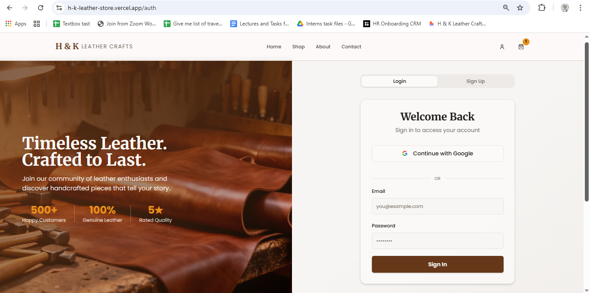

🛍 H&K Leather Store  
### AI-Powered E-Commerce Web Application


---

## 🔗 Live Demo
[Live Demo](https://h-k-leather-store.vercel.app/)

---

## 📌 Overview

H&K Leather Store is an AI-assisted e-commerce web application built using a modern low-code development approach.  
The project demonstrates how AI tools, frontend frameworks, and backend services can be combined to build a scalable and production-ready online store.

This project highlights:
- Full-stack integration
- Secure authentication
- Cloud database usage
- Deployment best practices
- AI-assisted development workflow

---

## 🚀 Features

- Secure user authentication
- Product listing and dynamic data management
- Supabase backend integration
- Responsive UI design
- Environment-based configuration
- Production deployment on Vercel

---

## 🛠 Tech Stack

### Frontend
- React
- TypeScript
- Tailwind CSS
- Lovable.dev (AI-assisted development)

### Backend
- Supabase (Database + Authentication)

### Deployment
- Vercel

---

## 📸 Screenshots

### 🏠 Homepage


### 🛒 Product Listing


### 🔐 Authentication


---

## 🧠 What This Project Demonstrates

- AI-assisted web application development
- Secure role-based authentication handling
- Backend API integration
- Cloud database management
- Clean deployment pipeline
- Structured, scalable project architecture

---

## 📂 Project Structure

```
public/
screenshots/
src/
supabase/
.gitignore
README.md
bun.lockb
components.json
eslint.config.js
index.html
package-lock.json
package.json
postcss.config.js
```

(Adjust if your structure differs.)

---

## ⚙️ Installation & Local Setup

### 1️⃣ Clone the repository

```
git clone https://github.com/kiranfatima013/H-kLeatherStore.git
cd H-kLeatherStore
```

### 2️⃣ Install dependencies

```
npm install
```

### 3️⃣ Configure Environment Variables

Create a `.env.local` file and add:

```
SUPABASE_URL=your_supabase_url
SUPABASE_ANON_KEY=your_supabase_key
```

### 4️⃣ Run locally

```
npm run dev
```

Application will run on:
```
http://localhost:3000
```

---

## 🌍 Deployment

The application is deployed using **Vercel** with:

- Environment variables configuration
- Optimized production build
- Secure Supabase integration

---

## 📈 Future Enhancements

- Payment gateway integration
- Admin dashboard
- Order management system
- AI-based product recommendations
- Performance optimization improvements

---

## 👩‍💻 Author

**Kiran Fatima**  
AI Automation & Generative AI Enthusiast  

GitHub: https://github.com/kiranfatima013  
LinkedIn: Add your LinkedIn URL here  

---

## 📄 License

This project is open-source and available under the MIT License.
